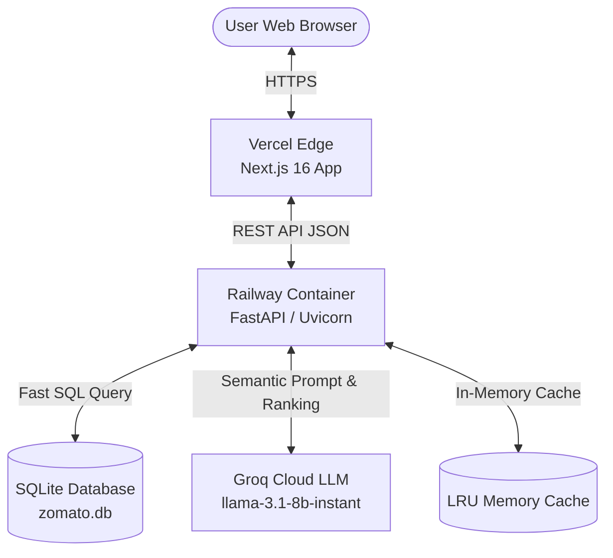

# 🌙 MidnightCrave: AI-Powered Zomato Restaurant Discovery

An intelligent, full-stack restaurant discovery engine that combines **strict database filtering** (location, budget, cuisines, rating) with **LLM-driven semantic ranking** (vibe, ambiance, dietary nuances, occasion) to recommend the best dining spots in Bangalore.

---

## 🌟 Key Features

- **🎯 Two-Stage Hybrid Recommendation Pipeline**:
  - **Stage 1 (SQL Database Filtering)**: Ultra-fast SQLite pre-filtering with composite indexing (`ix_location_budget_rating`) down to candidate sets in under 5ms.
  - **Stage 2 (Groq LLM Reasoning)**: High-speed LLM inference (`llama-3.1-8b-instant`) to rank recommendations and generate personalized 2-3 sentence dining rationales.
- **⚡ In-Memory LRU Cache with TTL**:
  - Sub-millisecond response times for repeat queries.
  - Thread-safe eviction policy and metrics observability endpoint (`/cache/stats`).
- **✨ Next.js 16 + React 19 + Tailwind CSS 4 Frontend**:
  - Glassmorphic dark theme ("Midnight / Nocturne" aesthetic).
  - Dynamic searchable dropdowns with backend data hydration.
  - AI reasoning card highlights with match badges.
- **☁️ Cloud-Ready Production Architecture**:
  - **Backend**: Containerized FastAPI service deployed on **Railway**.
  - **Frontend**: Edge-rendered Next.js client deployed on **Vercel**.

---

## 🏛️ System Architecture



---

## 📂 Project Structure

```text
├── Dockerfile                  # Container definition for backend
├── Procfile                    # Railway web process command
├── railway.json                # Railway Nixpacks deployment config
├── requirements.txt            # Python dependencies
├── restaurants.parquet         # Cleaned restaurants dataset
├── zomato.db                   # SQLite database with indexed tables
├── verify_deployment.py        # Automated E2E verification script
├── docs/                       # Architecture & deployment docs
├── src/                        # Backend FastAPI application
│   ├── main.py                 # API routes, CORS, health & cache stats
│   ├── database.py             # SQLAlchemy models & DB connection
│   ├── data_ingestion.py       # Data pipeline & cleaning
│   ├── llm_service.py          # Groq LLM integration & prompt logic
│   ├── cache.py                # Thread-safe in-memory cache
│   ├── schemas.py              # Pydantic request/response schemas
│   ├── test_api.py             # Backend test suite (10 tests)
│   └── test_deployment.py      # E2E deployment tests (6 tests)
└── frontend/                   # Next.js 16 frontend application
    ├── src/app/                # App router (layout, globals.css, page.tsx)
    ├── src/components/         # UI components (SearchForm, RestaurantCard, etc.)
    └── package.json            # Node.js dependencies
```

---

## 🚀 Getting Started Locally

### 1. Backend Setup
```bash
# Activate virtual environment
python -m venv venv
venv\Scripts\activate  # On Windows (or source venv/bin/activate on Linux/Mac)

# Install dependencies
pip install -r requirements.txt

# Configure environment variables (.env)
echo GROQ_API_KEY=your_groq_api_key_here > .env

# Run FastAPI server
uvicorn main:app --app-dir src --reload --port 8000
```
Backend will be live at `http://localhost:8000` (Swagger docs at `http://localhost:8000/docs`).

### 2. Frontend Setup
```bash
cd frontend
npm install
npm run dev
```
Frontend will be live at `http://localhost:3000`.

---

## 🧪 Testing & Verification

Run the comprehensive test suite:
```bash
# Run backend unit and integration tests:
pytest src/test_api.py -v

# Run deployment verification tests:
pytest src/test_deployment.py -v

# Run automated E2E verification CLI tool against live deployment:
python verify_deployment.py --backend https://<your-railway-url>.up.railway.app --frontend https://<your-vercel-url>.vercel.app
```

---

## 📡 API Reference

| Endpoint | Method | Description |
| :--- | :--- | :--- |
| `/` | `GET` | Service root and health info |
| `/health` | `GET` | Automated health check probe |
| `/options` | `GET` | Filter options (distinct locations, cuisines, budgets) |
| `/recommend` | `POST` | Primary recommendation endpoint with AI rationale |
| `/cache/stats` | `GET` | Cache hit rate, size, and observability metrics |
