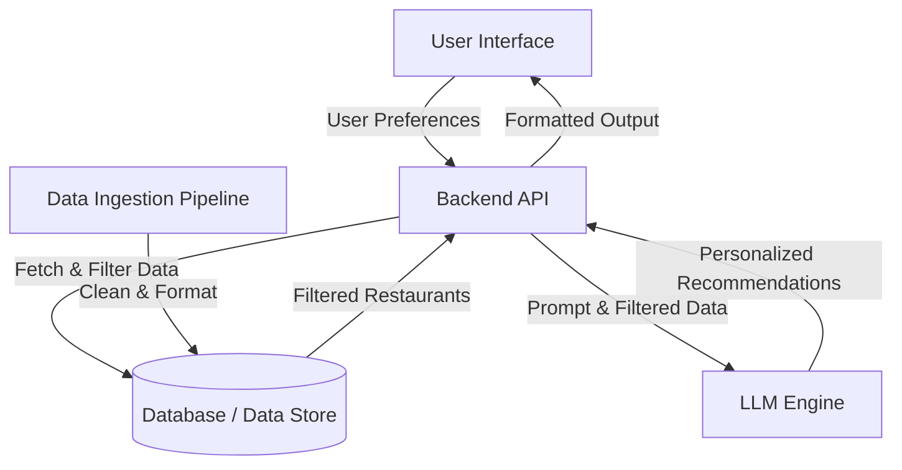

# Architecture Document: AI-Powered Restaurant Recommendation System

## 1. High-Level Architecture Overview

The system follows a modular client-server architecture with four main pillars: Data Ingestion Pipeline, User Interface (Frontend), Application Backend, and the LLM Recommendation Engine.

## 2. Component Details

### A. Data Ingestion Pipeline
- **Source:** Hugging Face Zomato dataset.
- **Process:** A script (e.g., Python using Pandas) that fetches the dataset, handles missing values, normalizes text fields (cuisine, location), and structures the data.
- **Storage:** Data can be loaded into an in-memory structure (like a Pandas DataFrame for an MVP), a traditional relational database (PostgreSQL/SQLite), or a NoSQL database (MongoDB).

### B. User Interface (Frontend)
- **Role:** Collect user inputs (Location, Budget, Cuisine, Minimum Rating, Extra Preferences) and display the AI-generated recommendations.
- **Design:** A clean, modern web or mobile interface.
- **Key Screens:** 
  - **Input Form:** Form fields to capture structured and unstructured preferences.
  - **Results View:** Interactive cards displaying Restaurant Name, Cuisine, Rating, Estimated Cost, and the AI-generated explanation.

### C. Application Backend (Integration Layer)
- **Role:** Acts as the orchestrator and middleman between the UI, the Database, and the LLM.
- **Responsibilities:**
  - Expose API endpoints for the frontend to submit requests.
  - **Pre-filtering:** Query the database to filter restaurants based on hard constraints (e.g., exact location, minimum rating, budget limits). This ensures the LLM isn't overwhelmed with irrelevant data and keeps token usage low.
  - **Prompt Engineering:** Construct a dynamic prompt containing the user's nuanced preferences and the pre-filtered restaurant data.
  - Manage API communication with the LLM provider.

### D. LLM Recommendation Engine
- **Role:** Provide reasoning, personalization, and final ranking.
- **Process:** The LLM receives the prompt, evaluates the pre-filtered candidates against the user's specific textual/soft preferences (e.g., "family-friendly", "quick service"), ranks the best options, and generates a human-like explanation for why each restaurant fits the user's exact needs.

## 3. Data Flow Sequence

1. **Initialization:** The data ingestion pipeline pulls data from Hugging Face, cleans it, and populates the database.
2. **User Request:** The user submits their preferences via the frontend.
3. **Query & Pre-filtering:** The backend performs a database query to retrieve a subset of restaurants (e.g., top 20-30 options) that match the strict criteria.
4. **Prompt Construction:** The backend injects this subset of restaurants and the user's preferences into a predefined LLM prompt template.
5. **LLM Inference:** The backend sends the prompt to the LLM (e.g., OpenAI API, Google Gemini, Anthropic).
6. **Response Parsing:** The backend receives the LLM's response, which includes the final ranked list and explanations, and validates the output format.
7. **Delivery:** The backend formats the response into JSON and sends it to the frontend to be rendered for the user.

## 4. Suggested Technology Stack (Example)

- **Frontend:** React.js / Next.js (for a robust web app) or Streamlit (for a rapid Python-based UI).
- **Backend:** Python (FastAPI or Flask). Python is highly recommended due to the ease of data manipulation and AI ecosystem integration.
- **Data Manipulation:** Python Pandas.
- **Database:** SQLite (MVP) or PostgreSQL (Production).
- **LLM Integration:** LangChain or direct API calls to an LLM provider.
