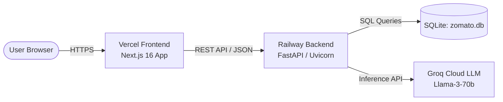

# 🚀 Production Deployment Plan: Zomato AI Dining Discoverer

This document details the step-by-step procedure to deploy the **Zomato AI Dining Recommendation System**:
- **Backend (FastAPI + SQLite + Groq LLM)** ➔ **Railway**
- **Frontend (Next.js 16 + Tailwind CSS)** ➔ **Vercel**

---

## 🏗️ 1. Architecture Overview



| Component | Platform | URL / Host | Key Responsibilities |
| :--- | :--- | :--- | :--- |
| **Backend** | [Railway](https://railway.app) | `https://<your-backend>.up.railway.app` | FastAPI endpoints (`/recommend`, `/options`, `/health`, `/cache/stats`), SQLite query execution, Groq AI inference |
| **Frontend** | [Vercel](https://vercel.com) | `https://<your-project>.vercel.app` | Next.js 16 client, interactive filter forms, real-time AI reasoning view, responsive modern UI |

---

## 🛠️ 2. Pre-Deployment Code Adjustments

Before pushing to production, two minor configuration updates ensure smooth communication across domains:

### A. Frontend: Dynamic Backend URL (`frontend/src`)
Update `fetch` calls to read `process.env.NEXT_PUBLIC_API_URL` with a fallback to `http://localhost:8000`:

* **`frontend/src/app/page.tsx`**:
  ```ts
  const API_BASE = process.env.NEXT_PUBLIC_API_URL || "http://localhost:8000";
  const response = await fetch(`${API_BASE}/recommend`, { ... });
  ```

* **`frontend/src/components/SearchForm.tsx`**:
  ```ts
  const API_BASE = process.env.NEXT_PUBLIC_API_URL || "http://localhost:8000";
  fetch(`${API_BASE}/options`)
  ```

### B. Backend: Railway Procfile / Start Command
Railway automatically detects Python via `requirements.txt`. Because backend source files reside inside `src/`, configure the start command with `--app-dir src`:

```bash
uvicorn main:app --app-dir src --host 0.0.0.0 --port $PORT
```

---

## 🚂 3. Phase 1: Deploy Backend to Railway

### Step 1: Push Code to GitHub
Ensure all your files (including `zomato.db` and `requirements.txt`) are committed and pushed to your GitHub repository.

### Step 2: Create a New Project on Railway
1. Log in to [Railway.app](https://railway.app).
2. Click **"+ New Project"** ➔ Select **"Deploy from GitHub repo"**.
3. Choose your `Milestone - Zomato` repository.

### Step 3: Configure Service Settings
1. Click on the newly created service in your Railway dashboard.
2. Go to **"Settings"**:
   - Under **Build & Deploy** ➔ **Custom Start Command**, enter:
     ```bash
     uvicorn main:app --app-dir src --host 0.0.0.0 --port $PORT
     ```
3. Under **Networking** ➔ Click **"Generate Domain"** (e.g., `https://zomato-ai-backend.up.railway.app`).

### Step 4: Add Environment Variables
Go to the **"Variables"** tab and add:
```env
GROQ_API_KEY=gsk_your_actual_groq_api_key_here
PORT=8000
PYTHONUNBUFFERED=1
```

### Step 5: Verify Backend Deployment
Once Railway finishes building, test the health endpoint:
```bash
curl https://<your-railway-url>.up.railway.app/health
```
Expected output:
```json
{"status": "healthy", "version": "1.0", "timestamp": "..."}
```

---

## ▲ 4. Phase 2: Deploy Frontend to Vercel

### Step 1: Import Project on Vercel
1. Log in to [Vercel.com](https://vercel.com).
2. Click **"Add New..."** ➔ **"Project"**.
3. Select your GitHub repository.

### Step 2: Configure Project Settings
1. **Framework Preset**: Next.js (automatically detected).
2. **Root Directory**: Click **Edit** and set it to **`frontend`** (critical, since Next.js lives in the `frontend/` folder).
3. **Build Command**: `next build` (default).
4. **Output Directory**: `.next` (default).

### Step 3: Set Environment Variables
Expand the **Environment Variables** section and add:
```env
NEXT_PUBLIC_API_URL=https://<your-railway-backend-url>.up.railway.app
```
*(Replace with your actual Railway public URL from Phase 1, without a trailing slash).*

### Step 4: Deploy
Click **"Deploy"**. Vercel will build the Next.js bundle and provide a live URL (e.g., `https://milestone-zomato.vercel.app`).

---

## 🔒 5. Phase 3: CORS & Security Configuration

By default, `src/main.py` has `allow_origins=["*"]`. To secure production after deploying:

1. Update `src/main.py`:
   ```python
   allowed_origins = [
       "http://localhost:3000",
       "https://<your-project>.vercel.app",  # Your production Vercel URL
   ]

   app.add_middleware(
       CORSMiddleware,
       allow_origins=allowed_origins,
       allow_credentials=True,
       allow_methods=["*"],
       allow_headers=["*"],
   )
   ```
2. Commit and push changes to trigger an automatic re-deploy on Railway.

---

## ✅ 6. Phase 4: End-to-End Verification Checklist

You can run automated end-to-end verification against your deployed URLs at any time:

```bash
# Verify deployed Railway Backend & Vercel Frontend:
python verify_deployment.py --backend https://<your-railway-url>.up.railway.app --frontend https://<your-vercel-url>.vercel.app

# Or verify local test environment:
pytest src/test_deployment.py -v
```

| Test Item | Action | Expected Result | Status |
| :--- | :--- | :--- | :---: |
| **Backend Root** | Open `https://<railway-url>/` | Status: `healthy`, Service info | ✅ |
| **Backend Health** | Open `https://<railway-url>/health` | Status: `healthy`, Version `1.0` | ✅ |
| **Backend Options** | Open `https://<railway-url>/options` | Returns JSON lists of locations, cuisines, budgets | ✅ |
| **Frontend UI** | Open `https://<vercel-url>` | Hero section, modern dropdowns, and form render properly | ✅ |
| **Dropdown Population** | Inspect location/cuisine dropdowns | Populated with real data from Railway backend | ✅ |
| **AI Recommendation** | Submit query: *"Mid budget Italian in Indiranagar for a quiet date"* | Returns curated cards with LLM rationale & match badge | ✅ |
| **Cache Performance** | Re-submit exact same query | Near-instant response (<20ms) served from memory cache | ✅ |
| **Cache Stats** | Open `https://<railway-url>/cache/stats` | Observability metrics showing cache hits & size | ✅ |

---

## 🚨 7. Troubleshooting & FAQs

* **Issue: Frontend shows "Failed to fetch recommendations"**
  * **Cause**: `NEXT_PUBLIC_API_URL` is missing or pointing to `localhost`.
  * **Fix**: Check Vercel project settings ➔ Environment Variables ➔ Ensure `NEXT_PUBLIC_API_URL` is set to the Railway HTTPS URL and trigger a redeploy.

* **Issue: Railway crashes with `ModuleNotFoundError: No module named 'database'`**
  * **Cause**: Uvicorn was started from root without specifying `--app-dir src` or `PYTHONPATH=src`.
  * **Fix**: Ensure the start command is `uvicorn main:app --app-dir src --host 0.0.0.0 --port $PORT`.

* **Issue: Groq LLM returns error / fallback**
  * **Cause**: `GROQ_API_KEY` is invalid or not set in Railway variables.
  * **Fix**: Verify the key in Railway Dashboard ➔ Variables tab.
